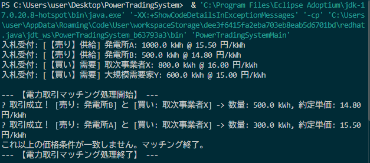

# 電力取引の基本概念を題材とした簡易マッチングシステム

##  概要 
　電力自由化・電力取引に関する業務知識を学習し、学習内容をもとにJavaで簡易的な電力取引マッチングシステムを作成。
 
　本システムは、発電事業者や新電力などの参加者からの入札データを受け取り、電力取引の基本的な処理フローをJavaでシミュレーションするものです。
 
　JEPX等の卸電力市場における、売り入札・買い入札の価格と数量の突合せを参考に、基本的な取引処理を簡易的にシミュレーションしています。

##  目的
電力取引業務の流れを理解するとともに、業務上の「入札」「約定」「数量」「価格」といったデータをJavaでどのように扱うかを学習することを目的として作成。

##  学習内容
- 電力小売・電源調達の基本的な業務フロー
- JEPX等の卸電力市場における入札・売買の仕組み
- 売り入札・買い入札、電力量（kWh）、入札価格（円/kWh）
- 需給側と発電側の取引マッチング・約定の基本
- バランシンググループ（BG）、需給バランス、インバランスの基本概念
- 送配電・託送など、電力取引に関連する基本的な業務用語

## 実行結果
プログラムを実行し、電力取引の入札データが正しくオブジェクトとして処理・出力された際のスクリーンショットです。

  

## 使用技術・概念
* **言語**: Java (JDK)
* **開発環境**: Visual Studio Code (VS Code)
* **ドメイン**: 電力取引・需給マッチングの基礎
* **設計概念・利用技術**: 
    - `Bid`クラスによる入札データのモデル化
    - 売り入札・買い入札の登録
    - 入札価格による優先順位付け
    - 売り注文と買い注文の価格条件によるマッチング
    - 約定数量の計算・残数量の更新
    - `List`、`ArrayList`、`Comparator`、ラムダ式、`Math.min()`等を使用
    - オブジェクト指向プログラミング、カプセル化、コンストラクタ
    - パッケージと標準ライブラリのインポート（`import`、`List`、`ArrayList`）
    - `toString()`メソッドのオーバーライド（オブジェクト情報の視覚化）
    - ソート・比較の仕組み（`Comparator`による並び替えの基礎）

##  入札データの設計
`Bid` クラスでは、電力取引における以下の要素をフィールドとして定義しています。

* **`participantId`**（事業者ID）：発電事業者や新電力などの参加者を識別するID
* **`isSellOrder`**（売買区分）：`true` = 売り入札（発電側）、`false` = 買い入札（需要・小売側）
* **`volumeKWh`**（電力量）：取引する電力の量 (kWh)
* **`priceYen`**（単価）：入札価格 (円/kWh)
